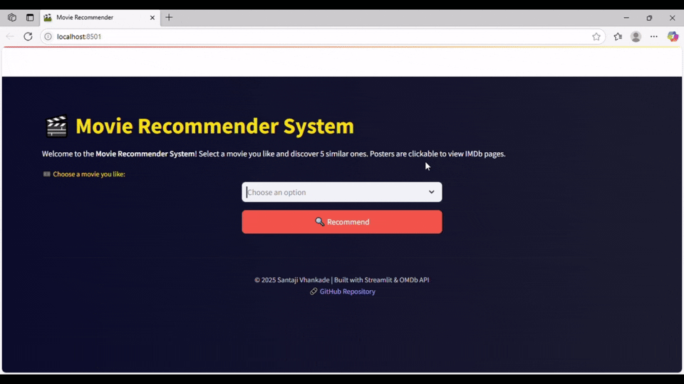

# 🎬 Movie Recommender System



An intelligent movie recommendation system built using **Machine Learning** and deployed with **Streamlit**.  
Given a movie title, it suggests 5 similar movies using content-based filtering.

---

## 🚀 Features

- 🔍 Content-based filtering using cosine similarity
- 🎯 Accurate recommendations based on cast, genre, overview, and keywords
- 🖼️ Poster images and IMDb ratings via OMDb API
- 🎥 Clickable posters that open directly on IMDb
- 🧠 NLP preprocessing using stemming and vectorization
- ⚡ Clean, interactive UI with Streamlit

---

## 🛠️ Tech Stack

| Tool            | Purpose                             |
|-----------------|-------------------------------------|
| Python          | Core programming language           |
| Pandas          | Data handling & preprocessing       |
| Scikit-learn    | Cosine similarity & vectorization   |
| NLTK            | Text stemming for better matches    |
| Streamlit       | Web UI                              |
| OMDb API        | Movie metadata (poster, rating)     |
| Pickle          | Model/data serialization            |

---

## 🧠 How It Works

1. Preprocess the TMDB movie and credit datasets
2. Merge and clean relevant features like `cast`, `crew`, `genres`, `keywords`, and `overview`
3. Generate a new column called `tags` from all those features
4. Stem all words for better matching (e.g., acting → act)
5. Vectorize tags using **CountVectorizer**
6. Compute cosine similarity matrix between all movies
7. On movie selection, fetch top 5 most similar titles
8. Retrieve poster, rating, and IMDb link using OMDb API
9. Display recommendations in a neat, clickable layout

---

## 📦 Setup Instructions

1. **Clone this repository**

```bash
git clone https://github.com/santaji-vhankade/movie_recommender_system.git
cd movie_recommender_system
